# TP 4: Máquinas de Turing Computadoras (MTC)

## Actividad 1

Calcular la imagen especular de una cadena definida sobre {a, b}, es decir, f(w)=reverso(w). Ejemplos: f(aabb)=bbaa y f(aba)=aba

### Grafo
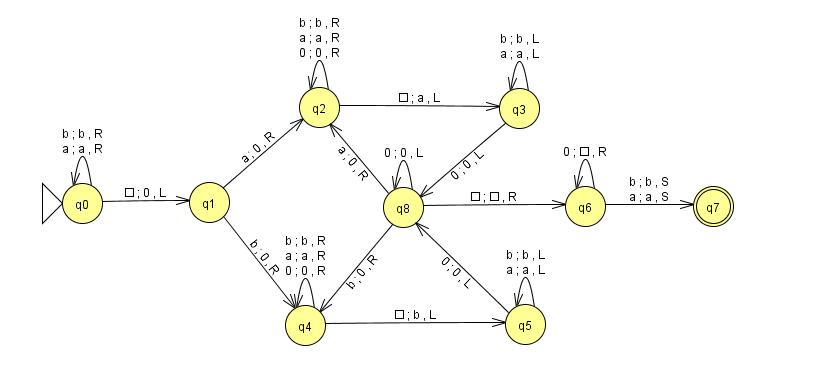

### Pruebas
.png)

---

## Actividad 2

Duplicar una cadena de aes y bes en la cinta. Ejemplo: si la MT comienza con abbaa□ en su cinta, luego de procesar su programa debe terminar con abbaa□abbaa

### Grafo
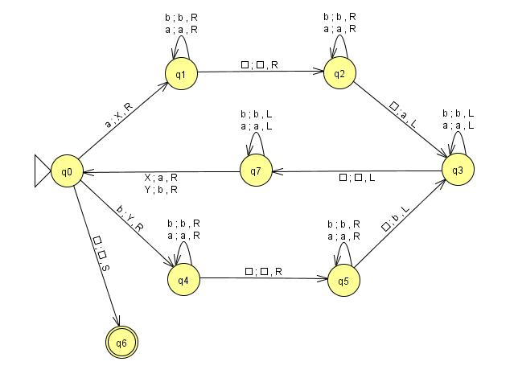

### Pruebas
.png)

(2).png)

(3).png)

---

## Actividad 3

Se dispone de una cinta en la que hay un número m de 1s seguido de un número n ≥ m de Aes. Se desea definir una MT que cambie las primeras m Aes por Bes. Se supone que la cabeza de la cinta inicialmente está en el 1 más a la izquierda

### Grafo
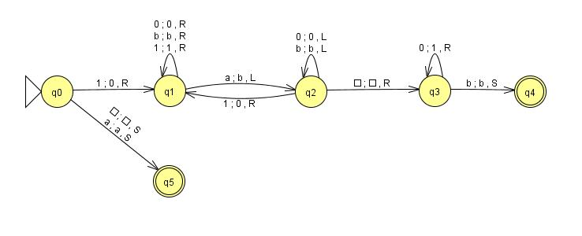

### Pruebas
.png)

---

## Actividad 4

Comprobar si dos palabras formadas con símbolos de Σ = {0, 1, 2} son iguales. Las dos palabras están separadas por el símbolo #

### Grafo
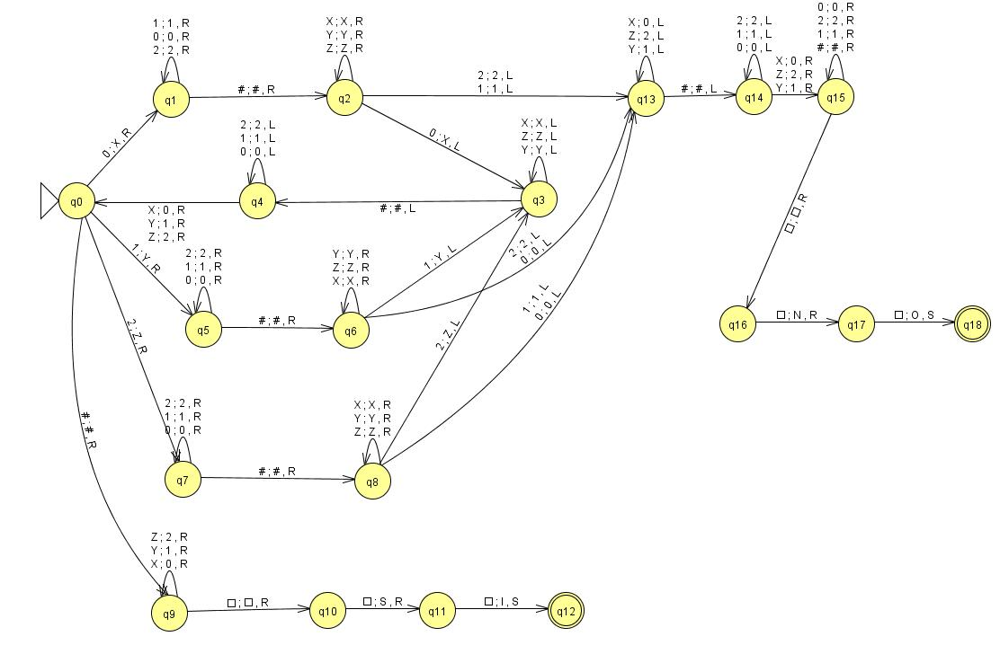

### Pruebas
.png)

---

## Actividad 5

Sumatoria de (n + i) , con 1 ≤ i ≤ n, con n codificado en unario

### Grafo
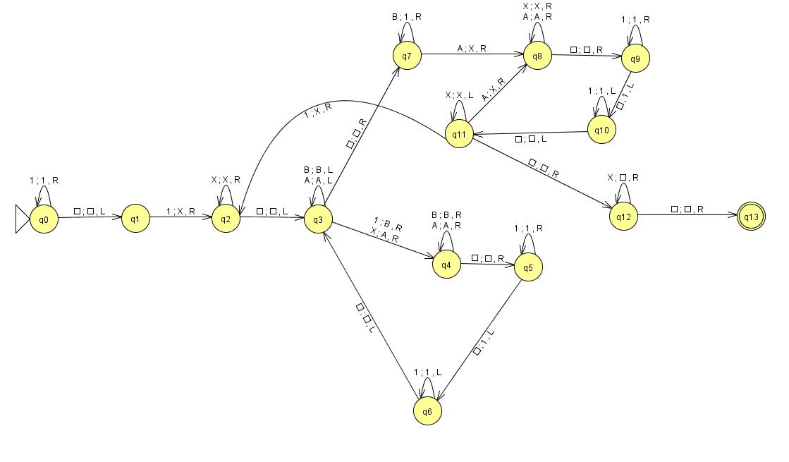

### Pruebas
.png)

---

## Actividad 6

[(x*y) / 2], para x, y > 0 codificados en unario

### Grafo
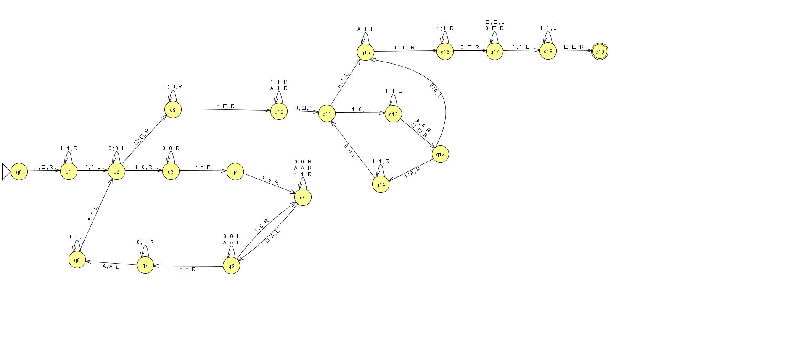

### Pruebas
.png)

---

## Actividad 7

x mod y, para x, y > 0, codificados en unario

### Grafo
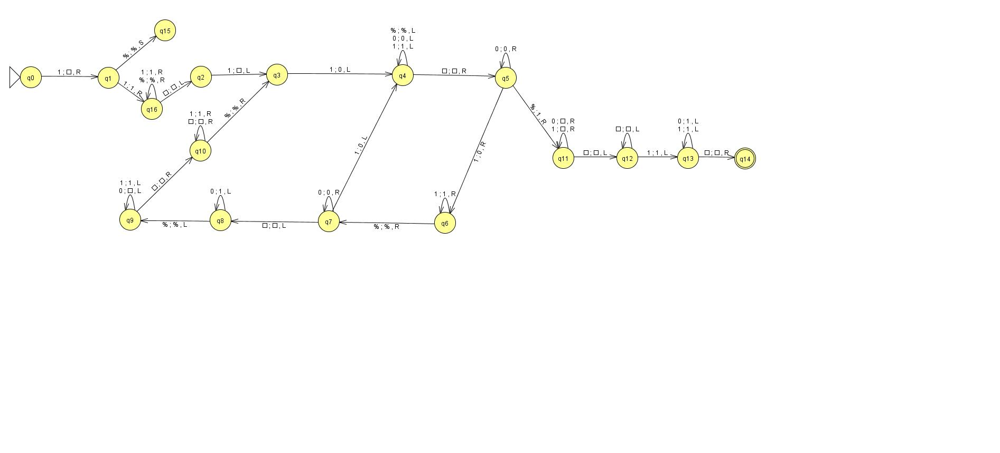

### Pruebas
.png)

---

## Actividad 8

La parte entera superior del promedio de n números mayores que cero codificados en unario. Usar como separador de números unarios en la cinta de entrada al símbolo 0. Ejemplo:
* Cinta de entrada: 111110111010 (números 5, 3 y 1)
* Cinta resultado: 111 (cálculo [(5 + 3 + 1) / 3] = 3)

### Grafo
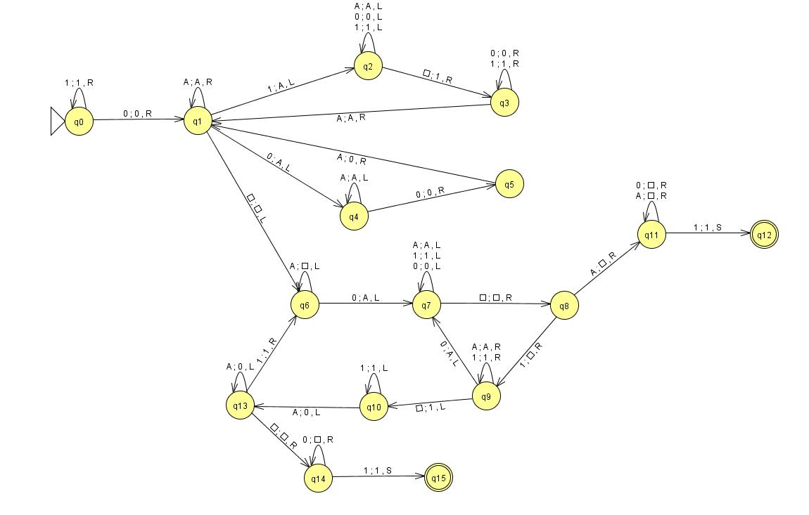

### Pruebas
.png)

---

## Actividad 9

Calcular a^nba^m -> a^(n+m)b

### Grafo
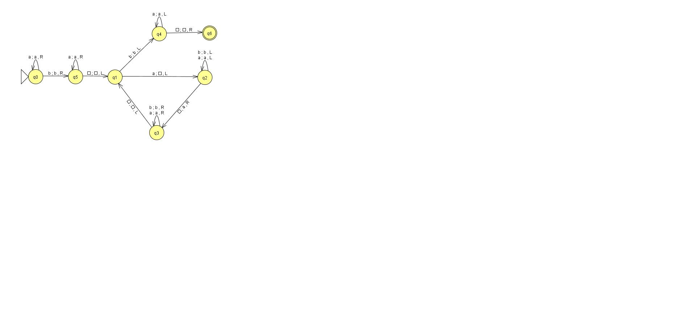

### Pruebas
.png)

---

## Actividad 10

Decidir si m < n, a^nb^m / n, m > 0, escribiendo en la cinta T (true) o F (false)

### Grafo
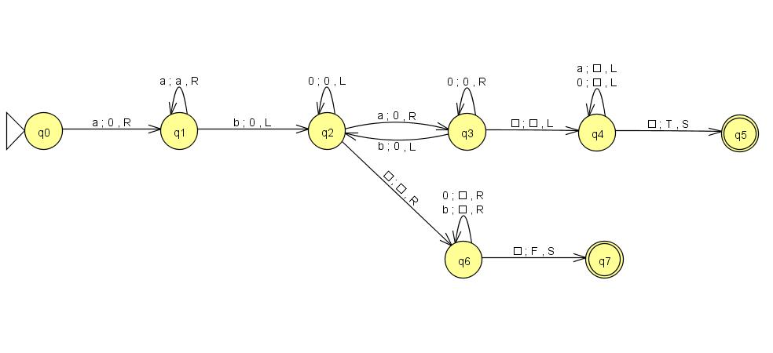

### Pruebas
.png)

---

## Actividad 11

Que recibe un número binario (cadena no vacía de 0’s y 1’s) y devuelve el siguiente número binario (es decir, le suma 1)

### Grafo
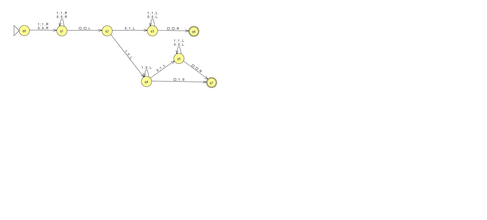

### Pruebas
.png)

---

## Actividad 12

Para eliminar el blanco que separa los dos argumentos x e y, moviendo los símbolos de y un lugar hacia la izquierda. Σ = {a, b}

### Grafos
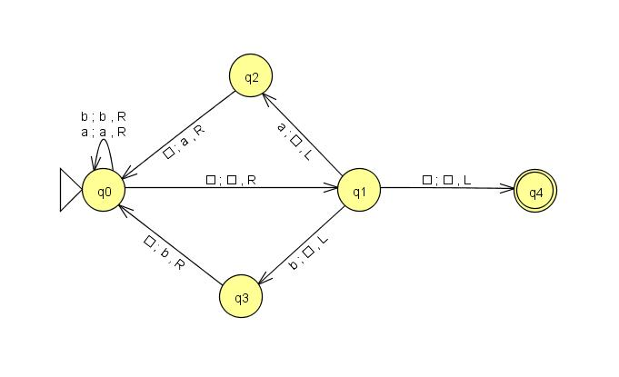

(Nota: se agregó una versión separando las palabras con el símbolo `$` ya que JFALP no permite ingresar una cadena de entrada con un símbolo blanco en el medio)

**Versión con el símbolo `$` en lugar del blanco intermedio**

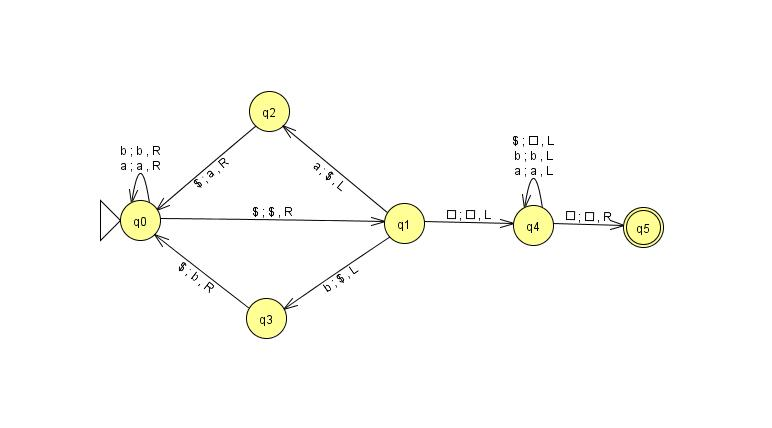

### Pruebas
.png)

---

## Actividad 13

MT de 3 cintas que reste el número binario de la segunda cinta del número binario de la primera y deje el resultado en la tercer cinta. Hacer otra, suponiendo que la MT es de 2 cintas y que el resultado se deja sobre la segunda. Hacerlo también para que el resultado quede en la primera

### Grafos

Con 3 cintas

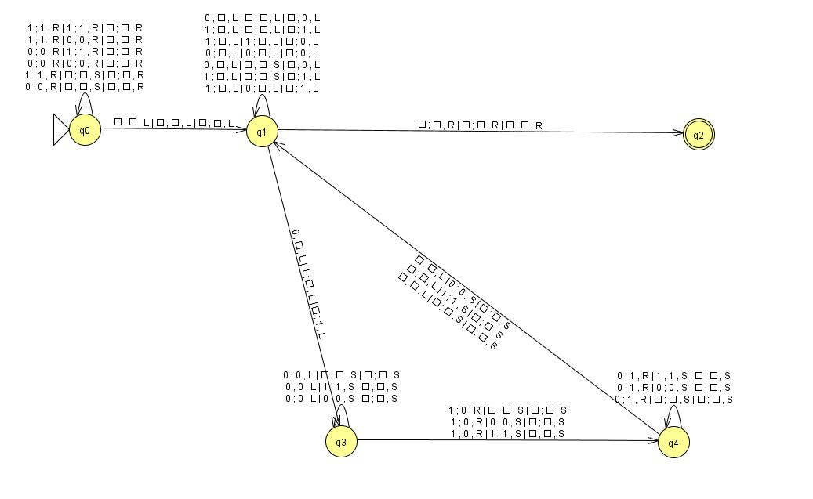

Con 2 cintas, devolviendo el resultado en la segunda

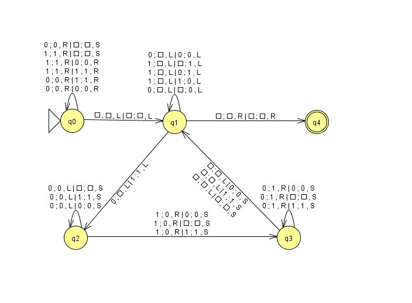

Con 2 cintas, devolviendo el resultado en la primera

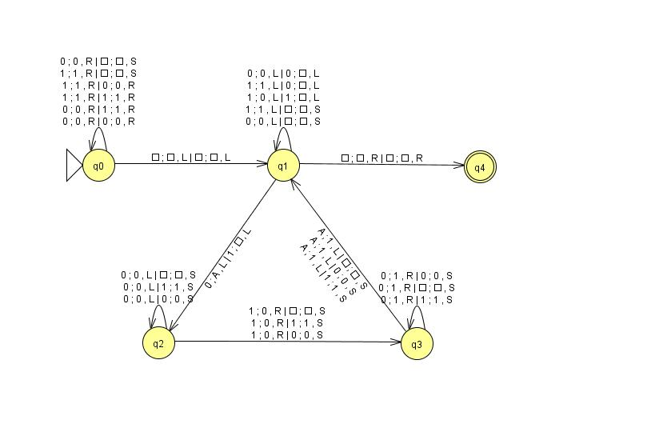

### Pruebas
.png)

(2).png)

(3).png)

(4).png)

---

## Actividad 14

MT de 3 cintas que determine si el número binario que está en la primera cinta es menor que el de la segunda. Si es menor, escribir el símbolo S sobre la tercer cinta y si no lo es, escribir los símbolos GE sobre la tercer cinta

### Grafo
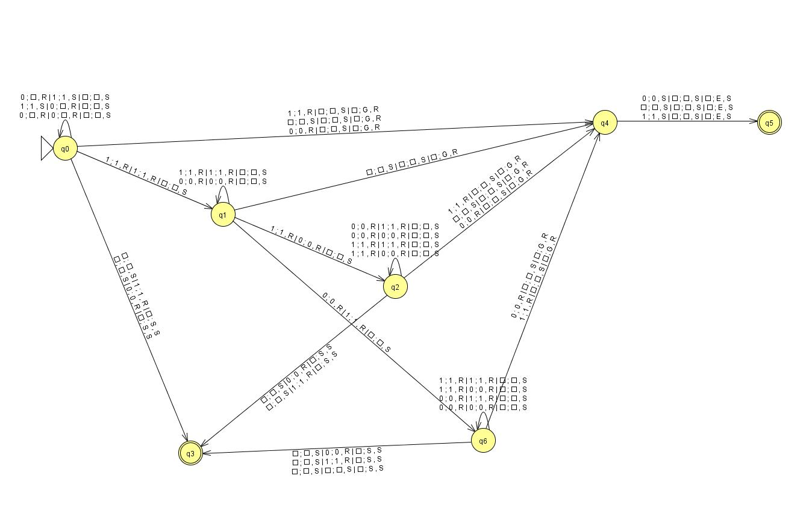

### Pruebas
.png)

(2).png)

(3).png)

(4).png)

---

## Actividad 15

Una cinta contiene dos cadenas binarias X e Y separadas por el símbolo * tales que la longitud de cada cadena es la mínima necesaria para representar el número correspondiente (es decir, que ninguno de los números comienzan con cero). En esas condiciones construir una MT que devuelva los valores 0, 1 ó 2 según sea X = Y, X > Y o X < Y respectivamente

### Grafos
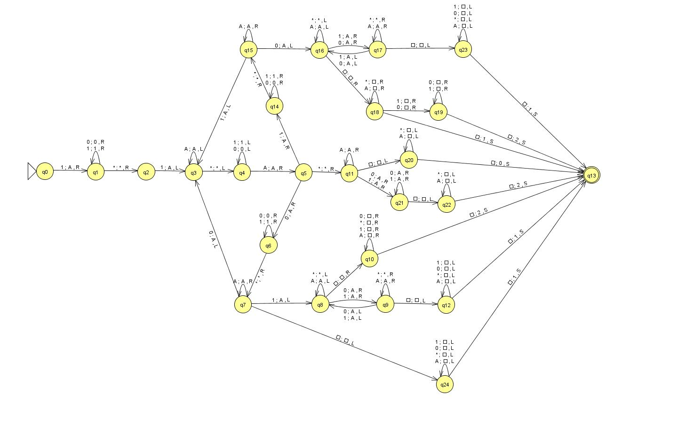

### Pruebas
.png)

---

## Actividad 16

Dados dos números binarios separados por el símbolo *, defina y construya una MT que calcule la suma de ambos números

### Grafo
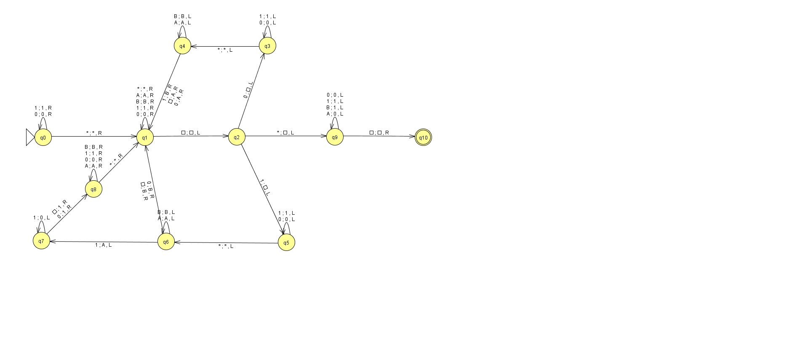

### Pruebas
.png)

---

## Actividad 17

Dadas dos cadenas de palotes, separadas por el símbolo * defina y construya una MT que decida si la primera cadena es submúltiplo de la segunda, y cuántas veces. Pruebe la solución hallada con las siguientes cadenas:
* `|||*||||||` (es submúltiplo, dos veces)
* `||*|||||` (no es submúltiplo)

### Grafo
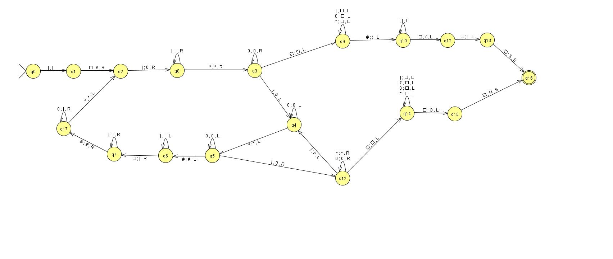

### Pruebas
.png)
